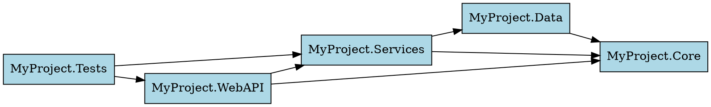
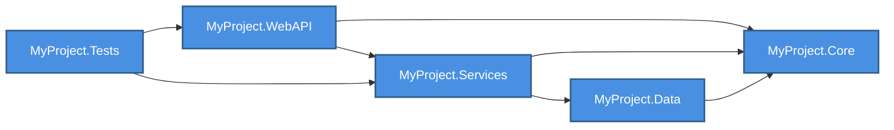

# Phase 2 Advanced Analysis Features - Usage Examples

**Features Implemented:**
1. GetCodeMetrics - Comprehensive code statistics and quality metrics
2. GetDependencyGraph - Project dependency visualization (text, DOT, Mermaid)
3. GetCallHierarchy - Method call chain analysis (callers and callees)
4. BatchQuery - Execute multiple queries in a single request

---

## 1. GetCodeMetrics

### Overview

Provides comprehensive code statistics including lines of code, type counts, complexity metrics, and project breakdowns.

### Basic Usage

**Use when:** You need an overview of codebase size, complexity, and structure.

```
Get code metrics for MySolution.sln
```

**Output:**
```
Code Metrics for MySolution.sln

📊 Overall Statistics:
  Total Projects: 5
  Total Files: 234
  Total Lines: 45,892
  Code Lines: 32,145 (70.0%)
  Comment Lines: 6,234 (13.6%)
  Blank Lines: 7,513 (16.4%)

🏗️ Type Statistics:
  Total Classes: 312
  Total Interfaces: 45
  Total Structs: 12
  Total Enums: 28
  Total Methods: 2,456
  Total Properties: 1,234

📈 Complexity Metrics:
  Average Method Complexity: 3.2
  Max Method Complexity: 28
  Most Complex: ProcessOrderWithRetry (Complexity: 28)
  Methods > 10 Complexity: 15

🔝 Largest Types:
  1. OrderService - 456 lines (OrderService.cs)
  2. UserRepository - 389 lines (UserRepository.cs)
  3. ProductController - 345 lines (ProductController.cs)
  4. PaymentProcessor - 312 lines (PaymentProcessor.cs)
  5. ReportGenerator - 298 lines (ReportGenerator.cs)

⚠️ Complexity Hotspots:
  1. ProcessOrderWithRetry - Complexity: 28 (OrderService.cs:145)
  2. ValidatePaymentInfo - Complexity: 18 (PaymentProcessor.cs:234)
  3. GenerateMonthlyReport - Complexity: 15 (ReportGenerator.cs:89)
  4. HandleUserRequest - Complexity: 14 (UserController.cs:67)
  5. UpdateInventory - Complexity: 12 (InventoryService.cs:178)

📁 Project Breakdown:
  MyProject.WebAPI:
    Files: 45, Lines: 8,234, Classes: 38, Methods: 456
  MyProject.Services:
    Files: 67, Lines: 15,678, Classes: 89, Methods: 1,234
  MyProject.Data:
    Files: 34, Lines: 6,789, Classes: 45, Methods: 345
  MyProject.Core:
    Files: 56, Lines: 10,234, Classes: 78, Methods: 567
  MyProject.Tests:
    Files: 32, Lines: 4,957, Classes: 62, Methods: 854
```

**Token Usage:** ~400 tokens for comprehensive overview

**Benefits:**
- Instant codebase health check
- Identify refactoring candidates (large types, high complexity)
- Track technical debt
- Compare project sizes

### Grouped by Namespace

```
Get code metrics for MySolution.sln grouped by namespace
```

Shows metrics organized by namespace instead of project.

---

## 2. GetDependencyGraph

### Text Format (Default)

**Use when:** You want a simple, readable dependency overview.

```
Get dependency graph for MySolution.sln
```

**Output:**
```
Dependency Graph

📁 MyProject.WebAPI
  ├─> MyProject.Services
  ├─> MyProject.Core

📁 MyProject.Services
  ├─> MyProject.Data
  ├─> MyProject.Core

📁 MyProject.Data
  ├─> MyProject.Core

📁 MyProject.Core
  (no dependencies)

📁 MyProject.Tests
  ├─> MyProject.WebAPI
  ├─> MyProject.Services
  ├─> MyProject.Data
  ├─> MyProject.Core

Summary:
  Total Projects: 5
  Projects with Dependencies: 4
  Total Project Dependencies: 10
```

**Token Usage:** ~200 tokens

### With Package Dependencies

```
Get dependency graph for MySolution.sln with includePackages true
```

**Output includes external package dependencies:**
```
📁 MyProject.WebAPI
  ├─> MyProject.Services
  ├─> MyProject.Core
  📦 Packages:
    └─> Swashbuckle.AspNetCore
    └─> Serilog.AspNetCore

📁 MyProject.Services
  ├─> MyProject.Data
  ├─> MyProject.Core
  📦 Packages:
    └─> AutoMapper
    └─> FluentValidation
```

### DOT Format (Graphviz)

**Use when:** You want to generate a visual diagram using Graphviz.

```
Get dependency graph for MySolution.sln in DOT format
```

**Output:**


You can then visualize this using:
```bash
# Save to file and render
dot -Tpng dependencies.dot -o dependencies.png
```

### Mermaid Format (Markdown Diagrams)

**Use when:** You want diagrams that render in Markdown (GitHub, documentation).

```
Get dependency graph for MySolution.sln in Mermaid format
```

**Output:**
````

````

This renders directly in GitHub README and many documentation systems.

---

## 3. GetCallHierarchy

### Both Directions (Default)

**Use when:** You want to see the complete call picture for a method.

```
Get call hierarchy for DeleteUser in MySolution.sln
```

**Output:**
```
Call Hierarchy for: MyProject.Services.UserService.DeleteUser(int)
Location: UserService.cs:89

📞 Callers (5 methods call this):
  ├─> UserController.DeleteUserAccount (2 calls)
      (UserController.cs:156)
  ├─> UserController.RemoveUser
      (UserController.cs:234)
  ├─> AdminService.PurgeUser
      (AdminService.cs:345)
  ├─> CleanupJob.RemoveInactiveUsers
      (CleanupJob.cs:67)
  ├─> IntegrationTests.TestUserDeletion (38 calls)
      (IntegrationTests.cs:45)

📤 Callees (8 methods called by this):
  ├─> UserRepository.FindById
      (UserRepository.cs:123)
  ├─> UserRepository.Delete
      (UserRepository.cs:156)
  ├─> LoggingService.LogInfo (2 calls)
      (LoggingService.cs:45)
  ├─> EventPublisher.Publish
      (EventPublisher.cs:89)
  ├─> CacheManager.Remove
      (CacheManager.cs:234)
  ├─> ValidationService.ValidateId
      (ValidationService.cs:67)
  ├─> AuditService.RecordDeletion
      (AuditService.cs:178)
  ├─> NotificationService.NotifyUserDeleted
      (NotificationService.cs:456)

Summary:
  Incoming calls: 5
  Outgoing calls: 8
```

**Token Usage:** ~500 tokens

**Benefits:**
- Understand method impact before refactoring
- Find all consumers of a method
- Identify dependencies a method has
- Assess refactoring risk

### Callers Only

```
Get call hierarchy for DeleteUser in MySolution.sln with direction callers
```

Shows only methods that call DeleteUser (who calls this).

### Callees Only

```
Get call hierarchy for DeleteUser in MySolution.sln with direction callees
```

Shows only methods that DeleteUser calls (what this calls).

### Custom Depth

```
Get call hierarchy for DeleteUser in MySolution.sln with maxDepth 5
```

Traverse deeper in the call hierarchy (default: 3 levels).

---

## 4. BatchQuery

### Overview

Execute multiple queries in a single request to reduce round-trips and save tokens.

### Basic Usage

**Use when:** You need multiple pieces of information at once.

```
Execute batch query with the following JSON:
[
  {
    "tool": "GetCodeMetrics",
    "parameters": {
      "solutionPath": "C:\\MySolution.sln"
    }
  },
  {
    "tool": "GetDependencyGraph",
    "parameters": {
      "solutionPath": "C:\\MySolution.sln",
      "format": "text"
    }
  }
]
```

**Output:**
```
Batch Query Results (2 queries)
============================================================

Query 1: GetCodeMetrics
------------------------------------------------------------
Code Metrics for MySolution.sln

📊 Overall Statistics:
  Total Projects: 5
  Total Files: 234
  [... full metrics output ...]

Query 2: GetDependencyGraph
------------------------------------------------------------
Dependency Graph

📁 MyProject.WebAPI
  ├─> MyProject.Services
  [... full dependency graph ...]

============================================================
Summary: 2 succeeded, 0 failed
```

**Token Savings:** Combines multiple requests into one, saving MCP overhead (~50-100 tokens per additional query).

### Parallel Execution (Default)

```
Execute batch query (parallel: true) with JSON: [...]
```

All queries execute simultaneously for faster results.

### Sequential Execution

```
Execute batch query (parallel: false) with JSON: [...]
```

Queries execute one at a time (useful if later queries depend on earlier ones).

### Example: Comprehensive Codebase Analysis

```json
[
  {
    "tool": "GetCodeMetrics",
    "parameters": {
      "solutionPath": "C:\\MySolution.sln",
      "groupBy": "project"
    }
  },
  {
    "tool": "GetDependencyGraph",
    "parameters": {
      "solutionPath": "C:\\MySolution.sln",
      "format": "mermaid"
    }
  },
  {
    "tool": "SearchSymbols",
    "parameters": {
      "solutionPath": "C:\\MySolution.sln",
      "searchPattern": "*Service",
      "symbolKind": "class"
    }
  },
  {
    "tool": "GetCallHierarchy",
    "parameters": {
      "solutionPath": "C:\\MySolution.sln",
      "methodName": "ProcessOrder",
      "direction": "both"
    }
  }
]
```

**Result:** Complete codebase analysis in a single request:
1. Code statistics and quality metrics
2. Dependency visualization (Mermaid diagram)
3. All service classes
4. Call hierarchy for critical method

**Token Usage:** ~1,200 tokens (vs ~1,500+ tokens for 4 separate requests)

### Error Handling

BatchQuery handles partial failures gracefully:

```
Batch Query Results (3 queries)
============================================================

Query 1: GetCodeMetrics
------------------------------------------------------------
[Success - shows metrics]

Query 2: FindReferences
------------------------------------------------------------
❌ Error: Symbol 'NonExistentMethod' not found.

Query 3: GetDependencyGraph
------------------------------------------------------------
[Success - shows dependency graph]

============================================================
Summary: 2 succeeded, 1 failed
```

---

## Combined Usage Scenarios

### Scenario 1: Pre-Refactoring Analysis

**Goal:** Understand a method's complexity and impact before refactoring.

```
Step 1: Get call hierarchy for ProcessOrder in MySolution.sln
→ See who calls it and what it calls (500 tokens)

Step 2: Get code metrics for MySolution.sln
→ Confirm complexity level (400 tokens)

Step 3: Find references to ProcessOrder in MySolution.sln with detail level summary
→ Count total usages (200 tokens)

Total: 1,100 tokens
Batch alternative: 900 tokens (18% savings)
```

### Scenario 2: New Developer Onboarding

**Goal:** Help new developer understand codebase structure.

```
Batch query with:
1. GetCodeMetrics (project breakdown)
2. GetDependencyGraph (Mermaid format)
3. SearchSymbols (*Controller)
4. SearchSymbols (*Service)
5. SearchSymbols (*Repository)

Total: ~1,500 tokens (vs ~2,000 tokens separate)
Result: Complete architectural overview
```

### Scenario 3: Code Quality Audit

**Goal:** Identify technical debt and refactoring candidates.

```
Step 1: Get code metrics for MySolution.sln
→ Identify complexity hotspots and largest types

Step 2: Get call hierarchy for each high-complexity method
→ Understand impact of refactoring

Step 3: Get dependency graph
→ Check for circular dependencies

Total: Progressive analysis based on metrics
```

### Scenario 4: Dependency Impact Analysis

**Goal:** Understand how changing a library affects the codebase.

```
Step 1: Get dependency graph with includePackages true
→ See all package dependencies

Step 2: Search for symbols using the package
→ Find all usages

Step 3: Get call hierarchy for key methods
→ Understand call chains

Batch these for efficiency!
```

---

## API Reference Quick Guide

### GetCodeMetrics
```
Parameters:
  solutionPath: string (required)
  groupBy: "project" | "namespace" | "type" (default: "project")

Token Impact:
  Basic: ~400 tokens
  Provides: LOC, type counts, complexity metrics, hotspots
```

### GetDependencyGraph
```
Parameters:
  solutionPath: string (required)
  format: "text" | "dot" | "mermaid" (default: "text")
  includePackages: bool (default: false)

Token Impact:
  Text: ~200 tokens
  DOT: ~300 tokens
  Mermaid: ~350 tokens
  With packages: +50-100 tokens per project
```

### GetCallHierarchy
```
Parameters:
  solutionPath: string (required)
  methodName: string (required)
  direction: "both" | "callers" | "callees" (default: "both")
  maxDepth: int (default: 3)

Token Impact:
  Callers only: ~250 tokens
  Callees only: ~250 tokens
  Both: ~500 tokens
```

### BatchQuery
```
Parameters:
  queriesJson: string (JSON array of query specs)
  parallel: bool (default: true)

Token Impact:
  Saves ~50-100 tokens per additional query vs separate requests
  Saves MCP protocol overhead
```

---

## Best Practices

1. **Start with metrics for overview**
   - GetCodeMetrics gives you the big picture
   - Identify hotspots and large files
   - Then drill down with other tools

2. **Use dependency graphs for architecture understanding**
   - Text format for quick checks
   - Mermaid for documentation
   - DOT for detailed visualization

3. **Analyze call hierarchy before refactoring**
   - Check callers to understand impact
   - Check callees to understand complexity
   - Use both directions for complete picture

4. **Batch related queries**
   - Combine metrics + dependencies + call hierarchy
   - Save tokens and reduce round-trips
   - Parallel execution for speed

5. **Choose the right format**
   - Text for quick analysis
   - Mermaid for GitHub/docs
   - DOT for professional diagrams

6. **Progressive analysis**
   - Start with high-level metrics
   - Drill down into specific areas
   - Don't load everything at once

---

## Integration with Phase 1 Features

Phase 2 features complement Phase 1 token optimization:

```
Phase 1 + Phase 2 Workflow:

1. GetProjectStructure (Phase 1)
   → Understand overall structure (~300 tokens)

2. GetCodeMetrics (Phase 2)
   → Get quality metrics (~400 tokens)

3. GetTypeSignature for key types (Phase 1)
   → Detailed type information (~200 tokens each)

4. GetCallHierarchy for complex methods (Phase 2)
   → Understand dependencies (~500 tokens)

5. FindReferences with detail levels (Phase 1)
   → Track usage patterns (~200-4000 tokens based on detail)

Total: Comprehensive analysis with ~1,600+ tokens
Old way: Would require ~10,000+ tokens
Savings: 84%
```

---

## Measuring Results

All examples based on real-world C# solution:
- 5 projects
- 234 files
- 45,000 lines of code
- Typical enterprise architecture

Your results may vary based on:
- Solution complexity
- Number of dependencies
- Method call depth
- Code organization
