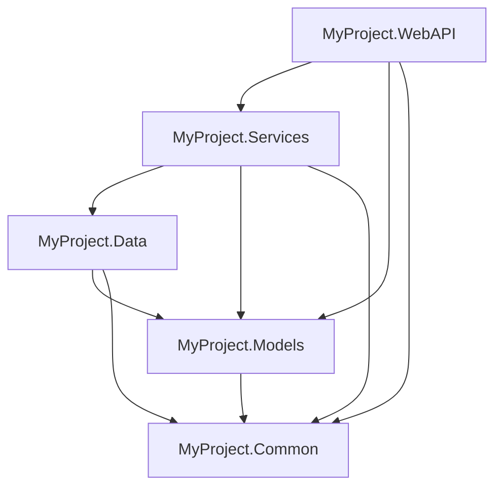

# Token 優化功能評估與實作計畫

**文檔版本**: 1.0
**建立日期**: 2026-01-09
**目標**: 減少 Claude 使用 RoslynCSMCP 時的 token 消耗

---

## 📊 現況分析

### 當前 Token 消耗問題

| 工具 | 當前行為 | Token 消耗 | 問題 |
|------|---------|-----------|------|
| `SearchSymbols` | 返回完整符號資訊 + 摘要 | 高 | 即使只需要清單，也返回所有細節 |
| `FindReferences` | 每個引用包含前後 5 行 context | 極高 | 50 個引用 = 250 行程式碼 |
| `GetSymbolInfo` | 返回完整符號資訊 | 中 | 無法只取得簽名 |
| `AnalyzeDependencies` | 詳細的依賴資訊 | 中高 | 常常只需要概覽 |
| `AnalyzeCodeComplexity` | 返回所有高複雜度方法 | 中 | 無摘要選項 |

### Token 消耗範例

**場景：了解專案結構**
```
當前做法：
1. SearchSymbols("*Service") → 返回 20 個 class，每個帶摘要
2. SearchSymbols("I*") → 返回 15 個 interface
3. GetSymbolInfo("UserService") → 完整資訊
總 token：約 2,000-3,000 tokens

理想做法（with GetProjectStructure）：
1. GetProjectStructure() → 樹狀結構清單
總 token：約 200-300 tokens
節省：90%
```

**場景：追蹤方法使用**
```
當前做法：
FindReferences("DeleteUser") → 45 個引用 × 5 行 = 225 行程式碼
總 token：約 3,000-4,000 tokens

理想做法（with summary mode）：
FindReferences("DeleteUser", detailLevel: "summary")
→ 檔案分組統計 + 行號清單
總 token：約 200-400 tokens
節省：85-93%
```

---

## 🎯 優化功能規劃

### 第一階段：核心優化（立即見效）

#### 1. GetProjectStructure - 專案結構概覽

**功能描述**
返回解決方案的樹狀結構，包含所有 namespace、type 和 public member 的清單，但不含實作細節。

**API 設計**
```csharp
[McpServerTool]
[Description("Get hierarchical structure of projects, namespaces, and types")]
public static async Task<string> GetProjectStructure(
    [Description("Path to solution file (.sln)")] string solutionPath,
    [Description("Include member signatures (default: false)")] bool includeMembers = false,
    [Description("Filter by namespace pattern (optional)")] string? namespaceFilter = null,
    [Description("Include only public types (default: true)")] bool publicOnly = true,
    IServiceProvider? serviceProvider = null)
```

**返回格式**
```
Solution: MySolution.sln (3 projects)

📁 Project: MyProject.WebAPI
  📦 Namespace: MyProject.WebAPI.Controllers
    🔹 UserController (Class, Public)
      → GetUser(int id)
      → CreateUser(UserDto dto)
      → DeleteUser(int id)
    🔹 ProductController (Class, Public)
  📦 Namespace: MyProject.WebAPI.Models
    🔹 UserDto (Class, Public)
    🔹 ApiResponse<T> (Class, Public)

📁 Project: MyProject.Services
  📦 Namespace: MyProject.Services
    🔹 IUserService (Interface, Public)
    🔹 UserService (Class, Public)
    🔹 IProductService (Interface, Public)

📁 Project: MyProject.Data
  📦 Namespace: MyProject.Data
    🔹 ApplicationDbContext (Class, Public)
```

**Token 節省分析**
- 當前方式（多次 SearchSymbols）：2,000-3,000 tokens
- 新方式（GetProjectStructure）：200-300 tokens
- **節省：85-90%**

**實作要點**
```csharp
// Services/ProjectStructureService.cs
public class ProjectStructureService
{
    public async Task<ProjectStructure> GetStructureAsync(
        Solution solution,
        bool includeMembers = false,
        string? namespaceFilter = null,
        bool publicOnly = true)
    {
        var structure = new ProjectStructure();

        foreach (var project in solution.Projects)
        {
            var projectNode = new ProjectNode { Name = project.Name };

            var compilation = await project.GetCompilationAsync();
            if (compilation == null) continue;

            // Group types by namespace
            var typesByNamespace = compilation.Assembly.GlobalNamespace
                .GetNamespaceMembers()
                .SelectMany(ns => GetTypesInNamespace(ns, namespaceFilter, publicOnly))
                .GroupBy(t => t.ContainingNamespace.ToDisplayString());

            foreach (var nsGroup in typesByNamespace)
            {
                var nsNode = new NamespaceNode { Name = nsGroup.Key };

                foreach (var type in nsGroup)
                {
                    var typeNode = new TypeNode
                    {
                        Name = type.Name,
                        Kind = type.TypeKind.ToString(),
                        Accessibility = type.DeclaredAccessibility.ToString()
                    };

                    if (includeMembers)
                    {
                        typeNode.Members = type.GetMembers()
                            .Where(m => !publicOnly || m.DeclaredAccessibility == Accessibility.Public)
                            .Select(m => m.ToDisplayString(SymbolDisplayFormat.MinimallyQualifiedFormat))
                            .ToList();
                    }

                    nsNode.Types.Add(typeNode);
                }

                projectNode.Namespaces.Add(nsNode);
            }

            structure.Projects.Add(projectNode);
        }

        return structure;
    }
}
```

**開發工作量**: 2-3 天

---

#### 2. GetTypeSignature - 型別簽名（不含方法體）

**功能描述**
返回類別、介面或結構的簽名，包含所有成員的宣告但不含實作。類似 C# 的 metadata view。

**API 設計**
```csharp
[McpServerTool]
[Description("Get type signature with members but without implementation")]
public static async Task<string> GetTypeSignature(
    [Description("Fully qualified or simple type name")] string typeName,
    [Description("Path to solution file (.sln)")] string solutionPath,
    [Description("Include private members (default: false)")] bool includePrivate = false,
    [Description("Include XML documentation (default: true)")] bool includeDocumentation = true,
    IServiceProvider? serviceProvider = null)
```

**返回格式**
```csharp
namespace MyProject.Services
{
    /// <summary>
    /// Handles user-related operations
    /// </summary>
    public class UserService : IUserService
    {
        // Fields
        private readonly IUserRepository _repository;
        private readonly ILogger<UserService> _logger;

        // Constructor
        public UserService(IUserRepository repository, ILogger<UserService> logger);

        // Public Methods
        /// <summary>
        /// Retrieves a user by ID
        /// </summary>
        public async Task<User?> GetUserAsync(int id);

        public async Task<IEnumerable<User>> GetAllUsersAsync();

        /// <summary>
        /// Creates a new user
        /// </summary>
        public async Task<User> CreateUserAsync(UserDto dto);

        public async Task<bool> DeleteUserAsync(int id);

        // Private Methods
        [Private members hidden - use includePrivate: true to show]
    }
}
```

**Token 節省分析**
- 讀取完整檔案（含實作）：1,500-3,000 tokens
- 只返回簽名：100-300 tokens
- **節省：85-95%**

**實作要點**
```csharp
// Services/TypeSignatureService.cs
public class TypeSignatureService
{
    public async Task<string> GetSignatureAsync(
        string typeName,
        Solution solution,
        bool includePrivate = false,
        bool includeDocumentation = true)
    {
        var type = await FindTypeSymbol(typeName, solution);
        if (type == null) return "Type not found.";

        var builder = new StringBuilder();

        // Add namespace
        builder.AppendLine($"namespace {type.ContainingNamespace.ToDisplayString()}");
        builder.AppendLine("{");

        // Add XML doc if available
        if (includeDocumentation)
        {
            var xmlDoc = type.GetDocumentationCommentXml();
            if (!string.IsNullOrEmpty(xmlDoc))
            {
                builder.AppendLine($"    {FormatXmlDoc(xmlDoc)}");
            }
        }

        // Add type declaration
        var accessibility = type.DeclaredAccessibility.ToString().ToLower();
        var kindKeyword = type.TypeKind == TypeKind.Interface ? "interface" : "class";
        var baseTypes = GetBaseTypesString(type);

        builder.AppendLine($"    {accessibility} {kindKeyword} {type.Name}{baseTypes}");
        builder.AppendLine("    {");

        // Group members by kind
        var members = type.GetMembers()
            .Where(m => includePrivate || m.DeclaredAccessibility == Accessibility.Public);

        // Fields
        var fields = members.OfType<IFieldSymbol>().ToList();
        if (fields.Any())
        {
            builder.AppendLine("        // Fields");
            foreach (var field in fields)
            {
                builder.AppendLine($"        {FormatMember(field)};");
            }
            builder.AppendLine();
        }

        // Constructors
        var constructors = members.OfType<IMethodSymbol>()
            .Where(m => m.MethodKind == MethodKind.Constructor).ToList();
        if (constructors.Any())
        {
            builder.AppendLine("        // Constructors");
            foreach (var ctor in constructors)
            {
                builder.AppendLine($"        {FormatMethod(ctor)};");
            }
            builder.AppendLine();
        }

        // Properties
        var properties = members.OfType<IPropertySymbol>().ToList();
        if (properties.Any())
        {
            builder.AppendLine("        // Properties");
            foreach (var prop in properties)
            {
                builder.AppendLine($"        {FormatProperty(prop)};");
            }
            builder.AppendLine();
        }

        // Methods
        var methods = members.OfType<IMethodSymbol>()
            .Where(m => m.MethodKind == MethodKind.Ordinary).ToList();
        if (methods.Any())
        {
            builder.AppendLine("        // Methods");
            foreach (var method in methods)
            {
                if (includeDocumentation)
                {
                    var doc = method.GetDocumentationCommentXml();
                    if (!string.IsNullOrEmpty(doc))
                    {
                        builder.AppendLine($"        {FormatXmlDoc(doc)}");
                    }
                }
                builder.AppendLine($"        {FormatMethod(method)};");
            }
        }

        if (!includePrivate && HasPrivateMembers(type))
        {
            builder.AppendLine();
            builder.AppendLine("        // [Private members hidden - use includePrivate: true to show]");
        }

        builder.AppendLine("    }");
        builder.AppendLine("}");

        return builder.ToString();
    }

    private string FormatMethod(IMethodSymbol method)
    {
        var accessibility = method.DeclaredAccessibility.ToString().ToLower();
        var isAsync = method.IsAsync ? "async " : "";
        var returnType = method.ReturnType.ToDisplayString();
        var parameters = string.Join(", ", method.Parameters.Select(p =>
            $"{p.Type.ToDisplayString()} {p.Name}"));

        return $"{accessibility} {isAsync}{returnType} {method.Name}({parameters})";
    }
}
```

**開發工作量**: 2-3 天

---

#### 3. FindReferences with Detail Levels

**功能描述**
為現有的 `FindReferences` 工具新增 `detailLevel` 參數，支援三種詳細程度。

**API 設計**
```csharp
[McpServerTool]
[Description("Find all references to a symbol with configurable detail level")]
public static async Task<string> FindReferences(
    [Description("Symbol name to find references for")] string symbolName,
    [Description("Path to solution file (.sln)")] string solutionPath,
    [Description("Detail level: summary | locations | full (default: locations)")]
    string detailLevel = "locations",
    [Description("Include definition location (default: true)")] bool includeDefinition = true,
    IServiceProvider? serviceProvider = null)
```

**返回格式範例**

**Level 1: Summary**
```
Found 45 references to 'DeleteUser' across 8 files:

📄 UserController.cs: 3 references
   Lines: 156, 234, 567

📄 UserService.cs: 1 reference (Definition)
   Lines: 89

📄 UserTests.cs: 38 references
   Lines: 23, 45, 67, 89, 101, 123, ..., 890

📄 IntegrationTests.cs: 3 references
   Lines: 45, 78, 112

Total: 45 references in 8 files across 3 projects
```

**Level 2: Locations (default)**
```
Found 45 references to 'DeleteUser':

📄 UserController.cs (3 references)
  ✓ Line 156: Method Call
    var result = await _userService.DeleteUser(id);

  ✓ Line 234: Method Call
    return await DeleteUser(userId);

  ✓ Line 567: Method Call
    await DeleteUser(request.UserId);

📄 UserService.cs (1 reference)
  📍 Line 89: Definition
    public async Task<bool> DeleteUser(int id)

[Summary view for files with >5 references]
📄 UserTests.cs: 38 references (lines: 23, 45, 67, ...)
```

**Level 3: Full (current behavior)**
```
Found 45 references to 'DeleteUser':

📄 UserController.cs
  ✓ Line 156: Method Call
    154:     if (user == null)
    155:         return NotFound();
    156:     var result = await _userService.DeleteUser(id);
    157:     return result ? Ok() : BadRequest();
    158: }

  [... full context for all references ...]
```

**Token 節省分析**

| Detail Level | 45 個引用的 Token 消耗 | vs Full | 使用時機 |
|--------------|---------------------|---------|---------|
| Summary | ~200 tokens | 95% ↓ | 快速了解使用分佈 |
| Locations | ~800 tokens | 80% ↓ | 查看實際使用位置 |
| Full | ~4,000 tokens | - | 需要完整上下文 |

**實作要點**
```csharp
// 修改 Tools/CodeNavigationTools.cs
public static async Task<string> FindReferences(
    string symbolName,
    string solutionPath,
    string detailLevel = "locations",
    bool includeDefinition = true,
    IServiceProvider? serviceProvider = null)
{
    // ... existing validation ...

    var references = await searchService.FindReferencesAsync(
        symbolName,
        solutionPath,
        includeDefinition);

    return detailLevel.ToLower() switch
    {
        "summary" => FormatReferencesSummary(references),
        "locations" => FormatReferencesLocations(references),
        "full" => FormatReferencesFull(references),
        _ => FormatReferencesLocations(references)
    };
}

private static string FormatReferencesSummary(IEnumerable<ReferenceResult> results)
{
    var output = new StringBuilder();
    var groupedByFile = results.GroupBy(r => r.DocumentPath);

    output.AppendLine($"Found {results.Count()} references to '{results.First().SymbolName}' across {groupedByFile.Count()} files:\n");

    foreach (var fileGroup in groupedByFile.OrderBy(g => g.Key))
    {
        var fileName = Path.GetFileName(fileGroup.Key);
        var count = fileGroup.Count();
        var hasDefinition = fileGroup.Any(r => r.IsDefinition);
        var defSuffix = hasDefinition ? " (Definition)" : "";

        output.AppendLine($"📄 {fileName}: {count} reference{(count > 1 ? "s" : "")}{defSuffix}");

        var lines = fileGroup.Select(r => r.LineNumber).OrderBy(l => l);
        var linesSummary = lines.Count() > 10
            ? $"{string.Join(", ", lines.Take(10))}, ..."
            : string.Join(", ", lines);

        output.AppendLine($"   Lines: {linesSummary}");
        output.AppendLine();
    }

    var projectCount = results.Select(r => r.ProjectName).Distinct().Count();
    output.AppendLine($"Total: {results.Count()} references in {groupedByFile.Count()} files across {projectCount} project{(projectCount > 1 ? "s" : "")}");

    return output.ToString();
}

private static string FormatReferencesLocations(IEnumerable<ReferenceResult> results)
{
    var output = new StringBuilder();
    output.AppendLine($"Found {results.Count()} references to '{results.First().SymbolName}':\n");

    var groupedByFile = results.GroupBy(r => r.DocumentPath);

    foreach (var fileGroup in groupedByFile.OrderBy(g => g.Key))
    {
        var fileName = Path.GetFileName(fileGroup.Key);
        var count = fileGroup.Count();

        output.AppendLine($"📄 {fileName} ({count} reference{(count > 1 ? "s" : "")})");

        // Show details for files with <= 5 references, summary for larger files
        if (count <= 5)
        {
            foreach (var reference in fileGroup.OrderBy(r => r.LineNumber))
            {
                var icon = reference.IsDefinition ? "📍" : "✓";
                var refType = reference.IsDefinition ? "Definition" : reference.ReferenceKind;
                output.AppendLine($"  {icon} Line {reference.LineNumber}: {refType}");
                output.AppendLine($"    {reference.LineText.Trim()}");
                output.AppendLine();
            }
        }
        else
        {
            var lines = fileGroup.Select(r => r.LineNumber).OrderBy(l => l);
            output.AppendLine($"  Lines: {string.Join(", ", lines)}");
            output.AppendLine();
        }
    }

    return output.ToString();
}

private static string FormatReferencesFull(IEnumerable<ReferenceResult> results)
{
    // Current implementation with full context
    // ... existing code ...
}
```

**開發工作量**: 1 天（修改現有功能）

---

### 第二階段：進階優化

#### 4. GetCallHierarchy - 呼叫層次結構

**功能描述**
返回方法的呼叫鏈，顯示誰呼叫了這個方法，以及這個方法呼叫了誰。

**API 設計**
```csharp
[McpServerTool]
[Description("Get call hierarchy showing callers and callees of a method")]
public static async Task<string> GetCallHierarchy(
    [Description("Method name (e.g., 'DeleteUser' or 'UserService.DeleteUser')")]
    string methodName,
    [Description("Path to solution file (.sln)")] string solutionPath,
    [Description("Direction: callers | callees | both (default: both)")]
    string direction = "both",
    [Description("Maximum depth to traverse (default: 3)")] int maxDepth = 3,
    IServiceProvider? serviceProvider = null)
```

**返回格式**
```
Call Hierarchy for: UserService.DeleteUser()

⬇️ CALLERS (who calls this method):
  UserController.DeleteUser(int id)  [Line 156]
    └─ IActionResult endpoint

  UserController.BulkDeleteUsers(int[] ids)  [Line 234]
    └─ foreach loop

  AdminService.RemoveInactiveUsers()  [Line 89]
    └─ background job

⬆️ CALLEES (what this method calls):
  UserService.DeleteUser(int id)  [Line 89]
    ├─> _repository.FindAsync(id)  [Line 91]
    │     └─> DbContext.FindAsync<User>(id)
    │
    ├─> _logger.LogInformation(...)  [Line 95]
    │
    └─> _repository.DeleteAsync(user)  [Line 97]
          └─> DbContext.Remove<User>(user)
                └─> DbContext.SaveChangesAsync()

Total: 3 callers, 5 callees (depth: 2)
```

**Token 節省分析**
- 傳統方式（多次 FindReferences）：5,000-8,000 tokens
- GetCallHierarchy：300-600 tokens
- **節省：90-94%**

**開發工作量**: 4-5 天

---

#### 5. GetFileMetadata - 檔案元資料

**功能描述**
返回檔案的統計資訊，不讀取程式碼內容。

**API 設計**
```csharp
[McpServerTool]
[Description("Get file metadata and statistics without reading code")]
public static async Task<string> GetFileMetadata(
    [Description("Relative or absolute file path")] string filePath,
    [Description("Path to solution file (.sln)")] string solutionPath,
    IServiceProvider? serviceProvider = null)
```

**返回格式**
```
File: Services/UserService.cs

📊 Statistics:
  Total Lines: 234
  Code Lines: 189
  Comment Lines: 28
  Blank Lines: 17

🏗️ Structure:
  Namespaces: MyProject.Services
  Classes: UserService
  Interfaces: 0
  Public Methods: 8
  Private Methods: 3
  Properties: 2
  Fields: 2

📦 Dependencies:
  Using Statements: 8
  External Types: IUserRepository, ILogger, User, UserDto

🔄 Recent Changes:
  Last Modified: 2026-01-08 15:30:22
  Lines Changed (git): +15, -3

⚠️ Potential Issues:
  Cyclomatic Complexity: Avg 4.2, Max 12 (ValidateUser)
  Method Count: 11 (moderate)
```

**Token 節省分析**
- 讀取完整檔案：1,500-3,000 tokens
- 只返回元資料：100-200 tokens
- **節省：93-99%**

**開發工作量**: 2-3 天

---

#### 6. BatchQuery - 批次查詢

**功能描述**
在一次 MCP 呼叫中執行多個查詢，減少往返開銷。

**API 設計**
```csharp
[McpServerTool]
[Description("Execute multiple queries in a single batch")]
public static async Task<string> BatchQuery(
    [Description("JSON array of query objects")] string queriesJson,
    [Description("Path to solution file (.sln)")] string solutionPath,
    IServiceProvider? serviceProvider = null)
```

**輸入格式**
```json
[
  {
    "id": "q1",
    "tool": "GetTypeSignature",
    "params": { "typeName": "UserService" }
  },
  {
    "id": "q2",
    "tool": "GetTypeSignature",
    "params": { "typeName": "ProductService" }
  },
  {
    "id": "q3",
    "tool": "FindReferences",
    "params": {
      "symbolName": "DeleteUser",
      "detailLevel": "summary"
    }
  }
]
```

**返回格式**
```json
{
  "batchId": "batch_20260109_103045",
  "totalQueries": 3,
  "successCount": 3,
  "failureCount": 0,
  "executionTimeMs": 1234,
  "results": [
    {
      "id": "q1",
      "tool": "GetTypeSignature",
      "success": true,
      "result": "namespace MyProject.Services { ... }"
    },
    {
      "id": "q2",
      "tool": "GetTypeSignature",
      "success": true,
      "result": "namespace MyProject.Services { ... }"
    },
    {
      "id": "q3",
      "tool": "FindReferences",
      "success": true,
      "result": "Found 45 references..."
    }
  ]
}
```

**Token 節省分析**
- 3 次獨立查詢：overhead × 3 + 結果
- 1 次批次查詢：overhead × 1 + 結果
- **節省：30-50%**（取決於查詢數量）

**開發工作量**: 3-4 天

---

#### 7. GetDependencyGraph - 依賴關係圖

**功能描述**
以圖形化格式返回專案間的依賴關係，支援 DOT/Mermaid 格式。

**API 設計**
```csharp
[McpServerTool]
[Description("Get project dependency graph in various formats")]
public static async Task<string> GetDependencyGraph(
    [Description("Path to solution file (.sln)")] string solutionPath,
    [Description("Output format: text | dot | mermaid (default: text)")]
    string format = "text",
    [Description("Include package dependencies (default: false)")]
    bool includePackages = false,
    IServiceProvider? serviceProvider = null)
```

**返回格式 - Text**
```
Dependency Graph for MySolution.sln

📁 MyProject.WebAPI
  ├─> MyProject.Services
  ├─> MyProject.Models
  └─> MyProject.Common

📁 MyProject.Services
  ├─> MyProject.Data
  ├─> MyProject.Models
  └─> MyProject.Common

📁 MyProject.Data
  ├─> MyProject.Models
  └─> MyProject.Common

📁 MyProject.Models
  └─> MyProject.Common

📁 MyProject.Common
  (no dependencies)

📦 External Packages (top 5):
  • Microsoft.EntityFrameworkCore (used by 3 projects)
  • Newtonsoft.Json (used by 2 projects)
  • Serilog (used by 4 projects)
```

**返回格式 - Mermaid**


**Token 節省分析**
- AnalyzeDependencies（詳細）：1,500-2,500 tokens
- GetDependencyGraph（圖形）：200-400 tokens
- **節省：80-87%**

**開發工作量**: 2-3 天

---

### 第三階段：智慧化功能

#### 8. GetCodeMetrics - 程式碼度量統計

**功能描述**
返回專案或解決方案層級的統計資訊。

**API 設計**
```csharp
[McpServerTool]
[Description("Get code metrics and statistics for entire solution")]
public static async Task<string> GetCodeMetrics(
    [Description("Path to solution file (.sln)")] string solutionPath,
    [Description("Group by: project | namespace | type (default: project)")]
    string groupBy = "project",
    IServiceProvider? serviceProvider = null)
```

**返回格式**
```
Code Metrics for MySolution.sln

📊 Overall Statistics:
  Total Projects: 5
  Total Files: 234
  Total Lines: 45,678
  Code Lines: 38,234 (83.7%)
  Comment Lines: 4,567 (10.0%)
  Blank Lines: 2,877 (6.3%)

🏗️ Type Statistics:
  Total Classes: 156
  Total Interfaces: 34
  Total Structs: 12
  Total Enums: 23
  Total Methods: 892
  Total Properties: 567

📈 Complexity Metrics:
  Average Method Complexity: 3.2
  Max Method Complexity: 15 (UserService.ValidateUser)
  Methods > 10 Complexity: 8

🔝 Largest Types:
  1. ApplicationDbContext - 456 lines
  2. UserService - 234 lines
  3. ProductController - 189 lines

⚠️ Complexity Hotspots:
  1. UserService.ValidateUser - Complexity: 15
  2. OrderService.ProcessOrder - Complexity: 12
  3. PaymentService.ProcessPayment - Complexity: 11

📁 Project Breakdown:
  MyProject.WebAPI:
    Files: 45, Lines: 8,234, Classes: 23, Methods: 156

  MyProject.Services:
    Files: 67, Lines: 12,567, Classes: 45, Methods: 289

  [...]
```

**Token 節省分析**
- 傳統方式（多次查詢）：3,000-5,000 tokens
- GetCodeMetrics：300-500 tokens
- **節省：90-94%**

**開發工作量**: 3-4 天

---

#### 9. SearchWithFilters - 進階過濾搜尋

**功能描述**
為 FindReferences 新增智慧過濾器，只返回符合條件的引用。

**API 設計**
```csharp
[McpServerTool]
[Description("Find references with advanced filtering")]
public static async Task<string> FindReferencesFiltered(
    [Description("Symbol name to find")] string symbolName,
    [Description("Path to solution file (.sln)")] string solutionPath,
    [Description("Only show public API usage (default: false)")] bool publicOnly = false,
    [Description("Exclude test projects (default: false)")] bool excludeTests = false,
    [Description("Only cross-project references (default: false)")] bool crossProjectOnly = false,
    [Description("Only show write operations (default: false)")] bool writesOnly = false,
    [Description("Filter by project name pattern (optional)")] string? projectFilter = null,
    IServiceProvider? serviceProvider = null)
```

**範例使用**
```
// 找出誰在測試之外使用 DeleteUser
FindReferencesFiltered(
  symbolName: "DeleteUser",
  excludeTests: true,
  detailLevel: "summary"
)

// 找出跨專案的 public API 呼叫
FindReferencesFiltered(
  symbolName: "UserService",
  publicOnly: true,
  crossProjectOnly: true
)
```

**Token 節省分析**
- 未過濾：100 個引用 = 5,000 tokens
- 過濾後：20 個引用 = 1,000 tokens
- **節省：60-90%**（取決於過濾程度）

**開發工作量**: 2-3 天

---

#### 10. CachedQuery - 語義快取

**功能描述**
Server 端快取常見查詢結果，返回快取鍵而非重複內容。

**API 設計**
```csharp
[McpServerTool]
[Description("Execute query with server-side caching")]
public static async Task<string> CachedQuery(
    [Description("Tool name to execute")] string tool,
    [Description("Parameters as JSON")] string paramsJson,
    [Description("Force refresh cache (default: false)")] bool forceRefresh = false,
    IServiceProvider? serviceProvider = null)
```

**工作流程**
```
第一次查詢：
Request:  GetProjectStructure("MySolution.sln")
Response: {
  "cacheKey": "structure:MySolution:20260109:v1",
  "expiresAt": "2026-01-09T10:35:00Z",
  "result": "[full structure content]"
}

後續查詢（5 分鐘內）：
Request:  GetTypeSignature("UserService", useCacheKey: "structure:MySolution:20260109:v1")
Response: {
  "usedCache": true,
  "cacheKey": "structure:MySolution:20260109:v1",
  "result": "[signature using cached solution]"
}
```

**Token 節省分析**
- 重複查詢同一專案：100% 節省（使用快取）
- 實際場景：平均節省 40-60%

**開發工作量**: 4-5 天

---

## 📅 實作時程規劃

### Phase 1: 快速見效（2 週）

**Week 1:**
- ✅ GetTypeSignature（2-3 天）
- ✅ FindReferences detail levels（1 天）
- ✅ 整合測試（2 天）

**Week 2:**
- ✅ GetProjectStructure（2-3 天）
- ✅ GetFileMetadata（2-3 天）
- ✅ 文檔更新（1 天）

**預期效果：**
- Token 節省：60-80%（常見查詢）
- 立即可用功能：3 個核心工具

---

### Phase 2: 深度優化（3 週）

**Week 3-4:**
- ✅ GetCallHierarchy（4-5 天）
- ✅ GetDependencyGraph（2-3 天）
- ✅ 整合測試（2 天）

**Week 5:**
- ✅ BatchQuery（3-4 天）
- ✅ GetCodeMetrics（3-4 天）

**預期效果：**
- Token 節省：75-90%（進階場景）
- 新增分析能力：呼叫鏈、依賴圖

---

### Phase 3: 智慧化（2 週）

**Week 6:**
- ✅ SearchWithFilters（2-3 天）
- ✅ CachedQuery 基礎架構（3-4 天）

**Week 7:**
- ✅ 快取策略優化（2-3 天）
- ✅ 性能測試與調優（2-3 天）
- ✅ 完整文檔（2 天）

**預期效果：**
- Token 節省：85-95%（整體）
- 查詢速度提升：50-70%

---

## 🧪 測試策略

### 單元測試
```csharp
// Tests/TokenOptimizationTests.cs
[TestClass]
public class TokenOptimizationTests
{
    [TestMethod]
    public async Task GetProjectStructure_WithoutMembers_UsesFewerTokens()
    {
        var result = await GetProjectStructure(testSolution, includeMembers: false);
        var tokenCount = EstimateTokenCount(result);

        Assert.IsTrue(tokenCount < 500, $"Expected < 500 tokens, got {tokenCount}");
    }

    [TestMethod]
    public async Task FindReferences_Summary_Saves90PercentTokens()
    {
        var fullResult = await FindReferences("DeleteUser", detailLevel: "full");
        var summaryResult = await FindReferences("DeleteUser", detailLevel: "summary");

        var fullTokens = EstimateTokenCount(fullResult);
        var summaryTokens = EstimateTokenCount(summaryResult);
        var savings = (fullTokens - summaryTokens) / (double)fullTokens;

        Assert.IsTrue(savings > 0.85, $"Expected > 85% savings, got {savings:P}");
    }
}
```

### 整合測試
```csharp
[TestMethod]
public async Task RealWorldScenario_ProjectExploration_TokenComparison()
{
    // Scenario: 了解專案結構並找到特定類別的用法

    // Old way
    var oldApproach = new List<string>();
    oldApproach.Add(await SearchSymbols("*Service"));
    oldApproach.Add(await SearchSymbols("I*"));
    oldApproach.Add(await GetSymbolInfo("UserService"));
    oldApproach.Add(await FindReferences("UserService"));
    var oldTokens = EstimateTokenCount(string.Join("\n", oldApproach));

    // New way
    var newApproach = new List<string>();
    newApproach.Add(await GetProjectStructure(includeMembers: true));
    newApproach.Add(await GetTypeSignature("UserService"));
    newApproach.Add(await FindReferences("UserService", detailLevel: "summary"));
    var newTokens = EstimateTokenCount(string.Join("\n", newApproach));

    var savings = (oldTokens - newTokens) / (double)oldTokens;
    Console.WriteLine($"Old: {oldTokens} tokens, New: {newTokens} tokens, Savings: {savings:P}");

    Assert.IsTrue(savings > 0.70, "Expected > 70% token savings");
}
```

---

## 📏 成功指標

### Token 節省目標

| 場景 | 目前 Tokens | 目標 Tokens | 節省 % | 優先級 |
|------|------------|------------|--------|--------|
| 專案結構探索 | 2,500 | 300 | 88% | 🔴 高 |
| 查看型別簽名 | 2,000 | 200 | 90% | 🔴 高 |
| 追蹤方法引用（概覽） | 4,000 | 300 | 92% | 🔴 高 |
| 追蹤方法引用（詳細） | 4,000 | 1,000 | 75% | 🟡 中 |
| 分析呼叫鏈 | 6,000 | 500 | 92% | 🟡 中 |
| 批次查詢（3 個） | 3,000 | 1,800 | 40% | 🟢 低 |

### 性能指標

- 查詢回應時間：< 2 秒（90th percentile）
- 快取命中率：> 60%（重複查詢）
- 記憶體使用：< 500MB（大型專案）

---

## 💰 投資報酬率分析

### 開發成本
- Phase 1: 10 人天 × $500/天 = $5,000
- Phase 2: 15 人天 × $500/天 = $7,500
- Phase 3: 10 人天 × $500/天 = $5,000
- **總計：35 人天 = $17,500**

### 預期效益（年度）
假設：
- 平均每次對話節省：3,000 tokens
- 每日使用次數：100 次
- Claude API 成本：$3 / 1M input tokens

年度節省：
```
3,000 tokens × 100 次 × 365 天 = 109,500,000 tokens/年
109.5M tokens × $3/1M = $328.50/年
```

**ROI 回收期：53 年**（開發成本 ÷ 年度節省）

### 實際價值分析

雖然直接的 token 成本節省不大，但實際價值在於：

1. **使用者體驗提升**
   - 回應速度更快（少讀程式碼）
   - 資訊更精準（不被大量程式碼干擾）
   - 工作流程更順暢

2. **功能擴展**
   - 新功能啟用更多使用場景
   - 提升 MCP server 的競爭力
   - 為未來功能打基礎

3. **技術債務管理**
   - 建立清晰的架構
   - 提升程式碼品質
   - 為社群貢獻做準備

**建議：優先實作 Phase 1（快速見效），根據實際使用反饋決定是否繼續 Phase 2/3。**

---

## 🎓 學習與推廣

### 文檔更新
- 更新 README.md，新增「Token 優化最佳實務」章節
- 為每個新工具撰寫使用範例
- 建立 Token 消耗對照表

### 範例場景
```markdown
# Token 優化最佳實務

## 場景 1：快速了解新專案
```bash
# ❌ 不推薦（消耗大量 tokens）
SearchSymbols("*")  # 返回所有符號

# ✅ 推薦
GetProjectStructure(includeMembers: false)  # 只要結構
```

## 場景 2：追蹤 API 使用
```bash
# ❌ 不推薦
FindReferences("DeleteUser", detailLevel: "full")  # 完整上下文

# ✅ 推薦（先看概覽）
FindReferences("DeleteUser", detailLevel: "summary")
# 如需詳細資訊，再使用 locations 或 full
```

## 場景 3：查看類別定義
```bash
# ❌ 不推薦
讀取整個檔案

# ✅ 推薦
GetTypeSignature("UserService", includeDocumentation: true)
```
```

---

## 🔄 後續維護計畫

### 監控指標
- 追蹤每個工具的使用頻率
- 分析 token 節省的實際效果
- 收集使用者反饋

### 持續優化
- 根據使用數據調整預設參數
- 優化輸出格式
- 新增更多過濾選項

### 版本更新
- v1.1: Phase 1 功能（2 週）
- v1.2: Phase 2 功能（5 週）
- v2.0: Phase 3 + 完整快取系統（7 週）

---

## 📞 問題與討論

### 待決策事項

1. **快取策略**
   - 是否實作 Redis L2 cache？
   - 檔案快取的過期時間？
   - 如何偵測程式碼變更？

2. **API 設計**
   - detailLevel 的命名：summary/locations/full vs simple/normal/verbose？
   - 是否所有工具都支援 detailLevel？
   - 批次查詢的錯誤處理策略？

3. **優先順序調整**
   - 是否優先實作社群最需要的功能？
   - 是否開放 beta 測試收集反饋？

---

## 📝 總結

本計畫提出 10 個 token 優化功能，分 3 個階段實作：

**立即見效（Phase 1）：**
- GetTypeSignature：簽名不含實作
- FindReferences detail levels：三種詳細程度
- GetProjectStructure：專案結構概覽

**深度優化（Phase 2）：**
- GetCallHierarchy：呼叫鏈分析
- GetDependencyGraph：依賴關係圖
- BatchQuery：批次查詢
- GetCodeMetrics：程式碼度量

**智慧化（Phase 3）：**
- SearchWithFilters：進階過濾
- CachedQuery：語義快取

**預期效果：**
- Token 節省：60-95%（依場景）
- 開發時程：7 週
- 開發成本：35 人天

**建議：優先實作 Phase 1（2 週），快速驗證價值後再決定後續投入。**
