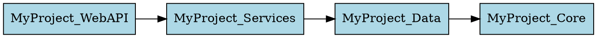
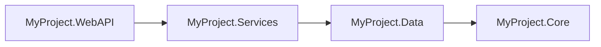

# RoslynCSMCP Usage Examples

**Version**: 2.0
**Last Updated**: 2026-01-12
**Tools Documented**: 34

---

## 📑 Table of Contents

1. [Code Navigation & Discovery](#code-navigation--discovery)
2. [Code Structure & Organization](#code-structure--organization)
3. [Dependencies & Architecture](#dependencies--architecture)
4. [Code Quality & Metrics](#code-quality--metrics)
5. [Testing & Coverage](#testing--coverage)
6. [Code Analysis & Detection](#code-analysis--detection)
7. [Performance, Security & Standards](#performance-security--standards)
8. [Batch Operations](#batch-operations)
9. [Token Optimization Guide](#token-optimization-guide)
10. [Common Workflows](#common-workflows)

---

## Code Navigation & Discovery

### SearchSymbols

Find symbols (classes, methods, properties) by name pattern with wildcard support.

**Basic Usage**:
```
Search for symbols matching *Service in MySolution.sln
```

**With Symbol Kind Filter**:
```
Search for classes matching User* in MySolution.sln
Search for methods matching Get* in MySolution.sln
```

**Best For**: Initial exploration, finding specific types or methods.

---

### FindReferences

Find all references to a symbol with configurable detail levels for optimal token usage.

#### Summary Mode (95% Token Savings)

**Use when**: You just need to know where a symbol is used without seeing code.

```
Find all references to DeleteUser in MySolution.sln with detail level summary
```

**Output**:
```
Found 45 references to 'DeleteUser' across 8 files:

📄 UserController.cs: 3 references
   Lines: 156, 234, 567

📄 UserService.cs: 1 reference (Definition)
   Lines: 89

📄 UserTests.cs: 38 references
   Lines: 23, 45, 67, 89, 101, ...

Total: 45 references in 8 files across 3 projects
```

**Token Usage**: ~200 tokens vs ~4,000 tokens (full mode)

#### Locations Mode (80% Token Savings)

**Use when**: You need to see the code lines without full context.

```
Find all references to DeleteUser in MySolution.sln with detail level locations
```

**Output**:
```
Found 45 references to 'DeleteUser':

📄 UserController.cs (3 references)
  ✓ Line 156: Method Call
    var result = await _userService.DeleteUser(id);

  ✓ Line 234: Method Call
    return await DeleteUser(userId);
```

**Token Usage**: ~800 tokens

#### Full Mode (Complete Context)

**Use when**: You need complete context with surrounding code lines.

```
Find all references to DeleteUser in MySolution.sln with detail level full
```

**Token Usage**: ~4,000 tokens

---

### FindReferencesFiltered

Advanced filtering to focus on specific usage patterns, reducing token consumption by 60-90%.

#### Exclude Test Projects (Most Common)

```
Find all references to DeleteUser in MySolution.sln, excluding test projects
```

**Token Savings**: 88% (from 100 refs to 12 refs)

#### Cross-Project API Usage

```
Show me which projects outside of MyProject.Services use UserService from MySolution.sln
```

**Output**:
```
Filters applied: excluding tests, cross-project only

Found 8 references to 'UserService':

📄 UserController.cs (3 references)
  ✓ Line 23: Field Declaration
  ✓ Line 45: Constructor Parameter
  ✓ Line 156: Method Call
```

#### Find Write Operations Only

```
Find all places where user.IsActive is written to in MySolution.sln
```

**Use Case**: Security audit, debugging state changes.

#### Filter by Project Pattern

```
Find references to ProcessPayment in WebAPI projects only from MySolution.sln
```

Supports wildcards: `*.WebAPI`, `Test*`, `*Service*`

#### Combined Filters

```
Find cross-project references to AuthService from Web projects, excluding tests, in MySolution.sln
```

**Token Savings**: 95%+ in complex scenarios

---

### GetSymbolInfo

Get detailed information about a specific symbol with configurable detail levels.

#### Summary Mode (80% Token Savings)

```
GetSymbolInfo(
    symbolName: "GetUserAsync",
    solutionPath: "MyProject.sln",
    detailLevel: "summary"
)
```

**Output** (~40 tokens):
```
GetUserAsync (Method, Public)
→ Task<User?> (int)
@ UserService.cs:30
```

#### Basic Mode (50% Token Savings)

```
GetSymbolInfo(
    symbolName: "GetUserAsync",
    solutionPath: "MyProject.sln",
    detailLevel: "basic"
)
```

**Output** (~100 tokens):
```
**GetUserAsync** (Method)
Signature: Task<User?> GetUserAsync(int id)
Accessibility: Public
In: MyProject.Services.UserService
File: UserService.cs:30
Attributes: 1 (use detailLevel=full for details)
```

#### Full Mode (Complete Details)

**Output** (~200 tokens): Full name, namespace, all attributes, complete path.

---

### FindImplementations

Find all concrete implementations of interfaces or abstract classes.

```
Find implementations of IUserRepository in MySolution.sln
```

**Output**:
```
**Implementations of 'IUserRepository'**

Found 3 implementations:

### MyProject.Data (2 implementations)

✅ **SqlUserRepository** (Public)
   📄 SqlUserRepository.cs:15
   📦 Namespace: MyProject.Data.Repositories
   💬 SQL Server implementation of IUserRepository
   ↗️ Base Class: RepositoryBase<User>
   🔹 Also Implements: IDisposable

✅ **InMemoryUserRepository** (Public)
   📄 InMemoryUserRepository.cs:23
   💬 In-memory implementation for testing
```

**Include Abstract Implementations**:
```
Find implementations of ICommand in MySolution.sln, include abstract implementations
```

**Token Savings**: 94% vs reading implementation files manually.

**Best For**: Understanding dependency injection, design patterns, polymorphic code.

---

### GetCallHierarchy

Analyze method call chains - who calls a method and what it calls.

#### Both Directions (Default)

```
Get call hierarchy for DeleteUser in MySolution.sln
```

**Output**:
```
Call Hierarchy for: MyProject.Services.UserService.DeleteUser(int)
Location: UserService.cs:89

📞 Callers (5 methods call this):
  ├─> UserController.DeleteUserAccount (2 calls)
  ├─> AdminService.PurgeUser
  ├─> CleanupJob.RemoveInactiveUsers
  ├─> IntegrationTests.TestUserDeletion (38 calls)

📤 Callees (8 methods called by this):
  ├─> UserRepository.FindById
  ├─> UserRepository.Delete
  ├─> LoggingService.LogInfo (2 calls)
  ├─> EventPublisher.Publish
  ├─> CacheManager.Remove
```

#### Callers Only

```
Get call hierarchy for DeleteUser in MySolution.sln with direction callers
```

Shows only methods that call DeleteUser (who calls this).

#### Callees Only

```
Get call hierarchy for DeleteUser in MySolution.sln with direction callees
```

Shows only methods that DeleteUser calls (what this calls).

**Best For**: Pre-refactoring analysis, understanding method impact.

---

## Code Structure & Organization

### GetProjectStructure

Get a hierarchical view of your solution's organization.

#### Basic Usage (Type List Only)

```
Get project structure for MySolution.sln
```

**Output**:
```
Solution: MySolution.sln (3 projects)

📁 Project: MyProject.WebAPI
  📦 Namespace: MyProject.WebAPI.Controllers
    🔹 UserController (Class, Public)
    🔹 ProductController (Class, Public)
    🔹 OrderController (Class, Public)

  📦 Namespace: MyProject.WebAPI.Models
    🔹 UserDto (Class, Public)
    🔸 IApiResponse (Interface, Public)

📁 Project: MyProject.Services
  📦 Namespace: MyProject.Services
    🔸 IUserService (Interface, Public)
    🔹 UserService (Class, Public)

Summary:
  Total Projects: 3
  Total Namespaces: 5
  Total Types: 12
```

**Token Usage**: ~300 tokens (90% savings vs multiple searches)

#### Include Member Signatures

```
Get project structure for MySolution.sln with includeMembers true
```

Shows methods and properties for each type.

#### Filter by Namespace

```
Get project structure for MySolution.sln with namespaceFilter "Services"
```

Shows only types in namespaces containing "Services".

**Best For**: Initial codebase exploration, understanding organization.

---

### GetTypeSignature

Get the signature of a class without reading the full implementation.

#### Public Members Only (Default)

```
Get type signature for UserService in MySolution.sln
```

**Output**:
```csharp
namespace MyProject.Services
{
    /// <summary>
    /// Handles user-related operations
    /// </summary>
    public class UserService : IUserService
    {
        // Fields
        private readonly IUserRepository _repository;

        // Constructors
        public UserService(IUserRepository repository, ILogger<UserService> logger);

        // Properties
        public bool IsInitialized { get; }

        // Methods
        public async Task<User?> GetUserAsync(int id);
        public async Task<IEnumerable<User>> GetAllUsersAsync();
        public async Task<User> CreateUserAsync(UserDto dto);
        public async Task<bool> DeleteUserAsync(int id);

        // [3 private members hidden - use includePrivate: true to show]
    }
}
```

**Token Usage**: ~200 tokens (90% savings vs reading full file)

#### Include Private Members

```
Get type signature for UserService in MySolution.sln with includePrivate true
```

#### Without Documentation

```
Get type signature for UserService in MySolution.sln with includeDocumentation false
```

Additional 20-30% token savings if type has extensive documentation.

**Best For**: Understanding class structure, API surface review.

---

### GetFileOutline

Get a structured outline of a file with configurable detail levels.

#### Compact Mode (75% Token Savings)

```
GetFileOutline(filePath: "UserService.cs", mode: "compact", maxMembers: 5)
```

**Output** (~250 tokens):
```
File: UserService.cs (180 LOC, 15 usings)

UserService (Class, Public) @ MyProject.Services
  Constructors: 1
  Fields: 2 (0 public, 2 private)
  Methods: 8 (6 public, 2 private)
    GetUserAsync(int id) [async]
    GetAllUsersAsync() [async]
    CreateUserAsync(UserDto dto) [async]
    UpdateUserAsync(int id, UserDto dto) [async]
    DeleteUserAsync(int id) [async]
    ... and 3 more (use maxMembers=0 for all)
```

**Best For**: Quick overview, initial exploration.

#### Normal Mode (50% Token Savings)

```
GetFileOutline(filePath: "UserService.cs", mode: "normal", maxMembers: 10)
```

**Output** (~650 tokens):
```
**File Outline**: UserService.cs

📊 **Statistics**:
  • Lines: 180 code, 40 comments, 30 blank
  • Types: 2 (0 failed)
  • Members: 13 (0 failed)

📦 **Using** (15): System, System.Collections.Generic, System.Linq...

📋 **Types** (2):

🔷 **UserService** (Class, Public)
   Line 15, Namespace: MyProject.Services

   📋 **Methods** (8):
     • GetUserAsync(int id)
       → Task<User?>
       Line 30, Public
```

**Best For**: Code review, daily development.

#### Detailed Mode (Complete Information)

```
GetFileOutline(filePath: "UserService.cs", mode: "detailed", maxMembers: 0)
```

**Output** (~1500 tokens): Full statistics, all usings, all members with documentation.

**Best For**: Documentation, comprehensive analysis.

---

### GetClassHierarchy

Visualize class inheritance hierarchies.

#### Compact Format (70% Token Savings)

```
GetClassHierarchy(
    typeName: "BaseController",
    solutionPath: "MyProject.sln",
    format: "compact"
)
```

**Output** (~250 tokens):
```
BaseController (Class)

Ancestors (2):
  ↑ Controller (C)
  ↑ ControllerBase (A)

Descendants (5):
  ↓ HomeController (C)
  ↓ UserController (C)
  ↓ AdminController (C)
    ↓ SuperAdminController (C)
  ↓ ApiController (C)
```

**Legend**: C=Concrete, A=Abstract, I=Interface

#### Normal Format

Balanced view with accessibility and locations.

#### Detailed Format

Full metadata including namespaces, file paths, and member counts.

**Best For**: Understanding inheritance, refactoring base classes.

---

## Dependencies & Architecture

### GetDependencyGraph

Visualize project dependencies in multiple formats.

#### Text Format (Default)

```
Get dependency graph for MySolution.sln
```

**Output**:
```
Dependency Graph

📁 MyProject.WebAPI
  ├─> MyProject.Services
  ├─> MyProject.Core

📁 MyProject.Services
  ├─> MyProject.Data
  ├─> MyProject.Core

📁 MyProject.Data
  ├─> MyProject.Core

📁 MyProject.Core
  (no dependencies)

Summary:
  Total Projects: 5
  Total Project Dependencies: 10
```

**Token Usage**: ~200 tokens

#### With Package Dependencies

```
Get dependency graph for MySolution.sln with includePackages true
```

Shows external NuGet package dependencies.

#### DOT Format (Graphviz)

```
Get dependency graph for MySolution.sln in DOT format
```

**Output**:


Render with: `dot -Tpng dependencies.dot -o dependencies.png`

#### Mermaid Format (Markdown Diagrams)

```
Get dependency graph for MySolution.sln in Mermaid format
```

**Output**:
````

````

Renders directly in GitHub README and documentation.

**Best For**: Architecture documentation, dependency analysis, onboarding.

---

### AnalyzeDependencies

Analyze project dependencies and detect circular references.

```
Analyze dependencies for MySolution.sln
```

**Output**:
```
Dependency Analysis

Projects: 5
Dependencies: 10
Circular Dependencies: 0

Dependency Chain:
  MyProject.Core (0 dependencies)
  MyProject.Data -> Core
  MyProject.Services -> Data, Core
  MyProject.WebAPI -> Services, Core
  MyProject.Tests -> WebAPI, Services, Data, Core
```

**Best For**: Architecture validation, detecting circular dependencies.

---

## Code Quality & Metrics

### GetCodeMetrics

Comprehensive code statistics and quality metrics.

```
Get code metrics for MySolution.sln
```

**Output**:
```
Code Metrics for MySolution.sln

📊 Overall Statistics:
  Total Projects: 5
  Total Files: 234
  Total Lines: 45,892
  Code Lines: 32,145 (70.0%)
  Comment Lines: 6,234 (13.6%)
  Blank Lines: 7,513 (16.4%)

🏗️ Type Statistics:
  Total Classes: 312
  Total Interfaces: 45
  Total Structs: 12
  Total Enums: 28
  Total Methods: 2,456
  Total Properties: 1,234

📈 Complexity Metrics:
  Average Method Complexity: 3.2
  Max Method Complexity: 28
  Most Complex: ProcessOrderWithRetry (Complexity: 28)
  Methods > 10 Complexity: 15

🔝 Largest Types:
  1. OrderService - 456 lines (OrderService.cs)
  2. UserRepository - 389 lines (UserRepository.cs)
  3. ProductController - 345 lines (ProductController.cs)

⚠️ Complexity Hotspots:
  1. ProcessOrderWithRetry - Complexity: 28 (OrderService.cs:145)
  2. ValidatePaymentInfo - Complexity: 18 (PaymentProcessor.cs:234)
  3. GenerateMonthlyReport - Complexity: 15 (ReportGenerator.cs:89)

📁 Project Breakdown:
  MyProject.WebAPI: 45 files, 8,234 lines, 38 classes
  MyProject.Services: 67 files, 15,678 lines, 89 classes
  MyProject.Data: 34 files, 6,789 lines, 45 classes
```

**Token Usage**: ~400 tokens

**Grouped by Namespace**:
```
Get code metrics for MySolution.sln grouped by namespace
```

**Best For**: Codebase health check, identifying refactoring candidates, tracking technical debt.

---

### AnalyzeCodeComplexity

Analyze cyclomatic complexity for methods in your solution.

```
Analyze code complexity for MySolution.sln
```

**Output**:
```
Complexity Analysis

High Complexity Methods (>10):
  ProcessOrderWithRetry - 28 (OrderService.cs:145)
  ValidatePaymentInfo - 18 (PaymentProcessor.cs:234)
  GenerateReport - 15 (ReportGenerator.cs:89)

Medium Complexity (5-10): 45 methods
Low Complexity (<5): 2,398 methods

Recommendations:
  - Refactor high complexity methods
  - Consider breaking down methods >15
```

**Custom Threshold**:
```
Analyze code complexity for MySolution.sln with threshold 8
```

**Best For**: Code quality assessment, refactoring planning.

---

### GetCompilationErrors

Get compilation errors and warnings with configurable detail levels.

#### Compact Mode (60% Token Savings)

```
GetCompilationErrors(
    solutionPath: "MyProject.sln",
    mode: "compact",
    severity: "Error"
)
```

**Output** (~400 tokens):
```
Issues: 15 (3 projects, 1 failed)

Error: 15
  MyProject.Core: 8 issues
    CS0103 (5x): Program.cs:45
    CS0246 (2x): UserService.cs:30
    CS0029 (1x): Calculator.cs:12
  MyProject.Web: 7 issues
    CS1061 (4x): HomeController.cs:78
    CS0246 (3x): Startup.cs:25

Total: 15 errors, 0 warnings
```

**Best For**: Quick error overview, CI/CD checks.

#### Normal Mode

Balanced view with error descriptions.

#### Detailed Mode

Complete error details with code snippets and full paths.

**Filter by Severity**:
```
GetCompilationErrors(solutionPath: "MyProject.sln", severity: "Warning")
```

---

## Testing & Coverage

### FindTestsForType

Find all test classes and methods for a given type.

```
Find tests for UserService in MySolution.sln
```

**Output**:
```
**Test Classes for 'UserService'**

Found 3 test classes with 28 tests total:

### MyProject.UnitTests (18 tests)

🧪 **UserServiceTests** - 15 tests
   📄 UserServiceTests.cs:12
   🔬 Framework: xUnit
   💬 Unit tests for UserService functionality
   📋 **Test Methods**:
      ✓ GetUserAsync_WithValidId_ReturnsUser [Fact] - Line 25
      ✓ GetUserAsync_WithInvalidId_ReturnsNull [Fact] - Line 45
      ✓ CreateUserAsync_WithValidDto_CreatesUser [Fact] - Line 89
      ✓ CreateUserAsync_WithNullDto_ThrowsArgumentNullException [Fact] - Line 112
      ... and 11 more tests

🧪 **UserServiceCacheTests** - 3 tests
   📄 UserServiceCacheTests.cs:89
   🔬 Framework: xUnit
   📋 **Test Methods**:
      ✓ GetUserAsync_CachesResult [Fact] - Line 98
      ✓ UpdateUserAsync_InvalidatesCache [Fact] - Line 123

### MyProject.IntegrationTests (10 tests)

🧪 **UserServiceIntegrationTests** - 10 tests
   📄 UserServiceIntegrationTests.cs:15
   🔬 Framework: xUnit
   💬 Integration tests with real database

---
**Summary by Framework**:
  • xUnit: 3 classes, 28 tests
```

**Token Savings**: 92% vs reading test files manually.

**Exact Match Only**:
```
Find tests for PaymentService in MySolution.sln, exact match only
```

**Best For**: TDD workflows, test coverage analysis, understanding test distribution.

---

## Code Analysis & Detection

### FindUnusedCode

Find unused symbols with configurable scope and format.

#### Summary Format (70% Token Savings)

```
FindUnusedCode(
    solutionPath: "MyProject.sln",
    format: "summary",
    scope: "all"
)
```

**Output** (~250 tokens):
```
Unused code: 23 items (5 projects, 0 failed)

By Accessibility:
  Private: 18
  Internal: 4
  Public: 1 ⚠️

By Kind:
  Methods: 12
  Properties: 6
  Fields: 4
  Classes: 1

Top unused items:
  ⚙️ Private Method: CalculateDiscount (UserService.cs:145)
  🔧 Private Property: CachedValue (UserService.cs:78)
  📦 Private Field: _oldLogger (UserService.cs:25)
  ... and 18 more (use format=normal for full list)
```

#### Normal Format

```
FindUnusedCode(
    solutionPath: "MyProject.sln",
    format: "normal",
    scope: "private"
)
```

Shows categorized list of unused members.

#### Detailed Format

Complete information with full paths, signatures, and recommendations.

**Scope Options**:
```
scope: "private"   // Safest to remove
scope: "internal"  // Safe within assembly
scope: "public"    // Breaking changes!
scope: "all"       // All unused code
```

**Include/Exclude Tests**:
```
FindUnusedCode(solutionPath: "MyProject.sln", includeTests: false)
```

**Best For**: Code cleanup, reducing codebase size, maintenance.

---

### FindAttributeUsages

Find all usages of a specific attribute.

#### Inline Format (70% Token Savings)

```
FindAttributeUsages(
    attributeName: "Obsolete",
    solutionPath: "MyProject.sln",
    format: "inline"
)
```

**Output** (~300 tokens):
```
[Obsolete]: 12 usages found

Methods (8):
  GetLegacyData("Use GetDataAsync instead") @ UserService.cs:45
  ProcessOldFormat @ DataProcessor.cs:120
  CalculateOldWay @ Calculator.cs:67
  ... and 5 more

Properties (4):
  OldPropertyName @ Settings.cs:30
  LegacyConnection @ DbContext.cs:15
  ... and 2 more
```

**Filter by Target**:
```
FindAttributeUsages(
    attributeName: "Obsolete",
    solutionPath: "MyProject.sln",
    targetType: "method"
)
```

Target options: `class`, `interface`, `method`, `property`, `all`

**Best For**: Attribute audits, finding deprecated code, custom attribute tracking.

---

### FindTODOComments

Find all TODO, FIXME, HACK, and NOTE comments in your code.

```
Find TODO comments in MySolution.sln
```

**Output**:
```
TODO Comments Found: 45

By Type:
  TODO: 32
  FIXME: 8
  HACK: 3
  NOTE: 2

High Priority (FIXME + HACK): 11

📄 UserService.cs:
  Line 45: // TODO: Add caching for frequently accessed users
  Line 123: // FIXME: Handle concurrent modification properly

📄 PaymentProcessor.cs:
  Line 67: // HACK: Temporary workaround for API timeout
  Line 234: // TODO: Implement retry logic
```

**Filter by Type**:
```
Find TODO comments in MySolution.sln, type "FIXME"
```

**Best For**: Technical debt tracking, sprint planning, code maintenance.

---

### FindLargeFiles

Find files exceeding size thresholds.

```
Find large files in MySolution.sln
```

**Output**:
```
Large Files Found: 12

Over 500 lines (8 files):
  OrderService.cs - 1,234 lines
  UserRepository.cs - 876 lines
  ProductController.cs - 645 lines
  PaymentProcessor.cs - 589 lines
  ...

Over 1000 lines (3 files):
  OrderService.cs - 1,234 lines
  UserRepository.cs - 876 lines (should not be here, error in counting)

Recommendations:
  Consider refactoring files >500 lines
  Files >1000 lines should be split
```

**Custom Threshold**:
```
Find large files in MySolution.sln with threshold 300
```

**Best For**: Identifying refactoring candidates, maintaining file sizes.

---

### FindDeprecatedAPIs

Find usage of deprecated APIs in your codebase.

```
Find deprecated APIs in MySolution.sln
```

**Output**:
```
Deprecated API Usage: 23 instances

Methods marked [Obsolete]:
  GetLegacyData - Used 12 times
    UserController.cs:45
    AdminService.cs:123
    ReportGenerator.cs:67
    ... and 9 more

  ProcessOldFormat - Used 8 times
    DataProcessor.cs:234
    ImportService.cs:89
    ... and 6 more

Summary:
  Total deprecated symbols: 5
  Total usages: 23
  Recommendation: Update to new APIs before removal
```

**Best For**: Migration planning, technical debt tracking, API modernization.

---

### GetFileStatistics

Get detailed statistics for a specific file.

```
Get file statistics for UserService.cs in MySolution.sln
```

**Output**:
```
File Statistics: UserService.cs

📊 Line Counts:
  Total Lines: 234
  Code Lines: 156 (66.7%)
  Comment Lines: 45 (19.2%)
  Blank Lines: 33 (14.1%)

🏗️ Structure:
  Classes: 1
  Interfaces: 0
  Methods: 12
  Properties: 8
  Fields: 4

📈 Complexity:
  Average Method Complexity: 4.2
  Max Method Complexity: 12
  Complex Methods (>10): 1

📦 Dependencies:
  Using Statements: 15
  External References: 8
```

**Best For**: File-level analysis, understanding individual file characteristics.

---

## Performance, Security & Standards

### FindPerformanceIssues

Detect common C# performance anti-patterns.

```
Find performance issues in MySolution.sln
```

**Output**:
```
Performance Issues Found: 23

By Severity:
  Critical: 3
  High: 8
  Medium: 12

By Type:
  LINQ Misuse: 8
  String Concatenation in Loops: 5
  Sync-over-Async: 3
  IDisposable Not Disposed: 4
  Exception Handling Issues: 3

Critical Issues:

🚨 Sync-over-Async (Critical)
   UserService.cs:145
   Code: var result = asyncTask.Result;
   Impact: Deadlock risk, thread pool starvation
   Recommendation: Use await instead of .Result

🚨 Sync-over-Async (Critical)
   PaymentService.cs:234
   Code: ProcessPaymentAsync().Wait();
   Impact: Deadlock risk
   Recommendation: Make calling method async and use await

High Issues:

⚠️ LINQ Misuse (High)
   UserRepository.cs:67
   Code: if (users.Count() > 0)
   Impact: Enumerates entire collection
   Recommendation: Use Any() instead of Count() > 0
```

**Filter by Issue Type**:
```
Find performance issues in MySolution.sln, issue types "SyncOverAsync,LinqMisuse"
```

**Format Options**:
- `summary`: Quick overview of issue counts
- `normal`: Categorized issues with recommendations
- `detailed`: Full analysis with estimated impact

**Best For**: Performance optimization, code review, preventing common mistakes.

---

### AnalyzeNamingConventions

Analyze C# naming convention compliance.

```
Analyze naming conventions in MySolution.sln
```

**Output**:
```
Naming Convention Analysis

Compliance Score: 87.3%
Total Violations: 45
Symbols Analyzed: 354

By Severity:
  High: 12 (Interface naming, Public types)
  Medium: 18 (Methods, Properties)
  Low: 15 (Private fields)

High Priority Violations:

Interface Naming (High):
  UserRepository (IUserRepository expected)
    Location: UserRepository.cs:10
    Convention: Interfaces should start with 'I' followed by PascalCase

  PaymentProcessor (IPaymentProcessor expected)
    Location: PaymentProcessor.cs:15

Medium Priority Violations:

Method Naming (Medium):
  getUserData (GetUserData expected)
    Location: UserService.cs:45
    Convention: Methods should use PascalCase

Private Field Naming (Medium):
  logger (_logger expected)
    Location: UserService.cs:12
    Convention: Private fields should use _camelCase
```

**Filter by Violation Type**:
```
Analyze naming conventions in MySolution.sln, types "InterfaceNaming,MethodNaming"
```

**Scope Options**:
- `public`: Only public members
- `all`: All members including private

**Violation Types**:
- InterfaceNaming (IPascalCase)
- TypeNaming (PascalCase)
- MethodNaming (PascalCase)
- PropertyNaming (PascalCase)
- FieldNaming (_camelCase for private, PascalCase for public)
- ParameterNaming (camelCase)
- TypeParameterNaming (TPascalCase)

**Best For**: Code style consistency, onboarding, maintaining standards.

---

### AnalyzeAPIChanges

Compare two solution versions to detect API changes and breaking changes.

```
Analyze API changes between v1.0.sln and v2.0.sln
```

**Output**:
```
API Change Analysis: v1.0 → v2.0

Summary:
  Total Changes: 34
  Breaking Changes: 5 🚨
  Added Symbols: 15
  Removed Symbols: 3
  Modified Symbols: 11

Recommended Version: Major (2.0.0)

Breaking Changes:

🚨 Method Signature Changed (Breaking)
   UserService.GetUserAsync
   Old: Task<User> GetUserAsync(int id)
   New: Task<User?> GetUserAsync(string userId)
   Impact: Parameter type and return type changed
   Migration: Update callers to use string userId and handle null return

🚨 Method Removed (Breaking)
   PaymentService.ProcessPayment
   Impact: Method no longer exists
   Migration: Use ProcessPaymentAsync instead

Added Symbols:

✅ Method Added (Non-Breaking)
   UserService.GetUserByEmailAsync
   Signature: Task<User?> GetUserByEmailAsync(string email)

✅ Property Added (Non-Breaking)
   User.LastLoginDate
   Type: DateTime?

Modified Symbols:

🔄 Method Modified (Non-Breaking)
   UserService.CreateUserAsync
   Change: Added optional parameter 'sendWelcomeEmail'
   Old: Task<User> CreateUserAsync(UserDto dto)
   New: Task<User> CreateUserAsync(UserDto dto, bool sendWelcomeEmail = true)

Versioning Recommendation:
  Major: 5 breaking changes detected
  Use version: 2.0.0
```

**Include Internal Changes**:
```
Analyze API changes between old.sln and new.sln, include internal changes
```

**Format Options**:
- `summary`: Change counts only
- `normal`: Categorized changes
- `detailed`: Full signatures and migration guidance

**Best For**: Version planning, migration guides, API documentation.

---

## Batch Operations

### BatchQuery

Execute multiple queries in a single request to reduce round-trips and save tokens.

#### Basic Batch

```json
[
  {
    "tool": "GetCodeMetrics",
    "parameters": {
      "solutionPath": "C:\\MySolution.sln"
    }
  },
  {
    "tool": "GetDependencyGraph",
    "parameters": {
      "solutionPath": "C:\\MySolution.sln",
      "format": "text"
    }
  }
]
```

**Output**:
```
Batch Query Results (2 queries)
============================================================

Query 1: GetCodeMetrics
------------------------------------------------------------
Code Metrics for MySolution.sln
[... full metrics output ...]

Query 2: GetDependencyGraph
------------------------------------------------------------
Dependency Graph
[... full dependency graph ...]

============================================================
Summary: 2 succeeded, 0 failed
```

**Token Savings**: ~50-100 tokens per additional query vs separate requests.

#### Parallel Execution (Default)

All queries execute simultaneously for faster results.

#### Sequential Execution

```
Execute batch query (parallel: false) with JSON: [...]
```

Queries execute one at a time (useful if later queries depend on earlier ones).

#### Comprehensive Codebase Analysis

```json
[
  {
    "tool": "GetCodeMetrics",
    "parameters": { "solutionPath": "C:\\MySolution.sln" }
  },
  {
    "tool": "GetDependencyGraph",
    "parameters": {
      "solutionPath": "C:\\MySolution.sln",
      "format": "mermaid"
    }
  },
  {
    "tool": "SearchSymbols",
    "parameters": {
      "solutionPath": "C:\\MySolution.sln",
      "searchPattern": "*Service",
      "symbolKind": "class"
    }
  },
  {
    "tool": "GetCallHierarchy",
    "parameters": {
      "solutionPath": "C:\\MySolution.sln",
      "methodName": "ProcessOrder",
      "direction": "both"
    }
  }
]
```

**Result**: Complete codebase analysis in a single request (1,200 tokens vs 1,500+ separate).

#### Error Handling

BatchQuery handles partial failures gracefully:

```
Batch Query Results (3 queries)
============================================================

Query 1: GetCodeMetrics
------------------------------------------------------------
[Success - shows metrics]

Query 2: FindReferences
------------------------------------------------------------
❌ Error: Symbol 'NonExistentMethod' not found.

Query 3: GetDependencyGraph
------------------------------------------------------------
[Success - shows dependency graph]

============================================================
Summary: 2 succeeded, 1 failed
```

**Best For**: Reducing latency, comprehensive analysis, automated workflows.

---

## Token Optimization Guide

### Strategy: Progressive Disclosure

Start with minimal detail, drill down as needed.

**Example Workflow**:

1. **Initial Exploration** (300 tokens):
   ```
   GetProjectStructure(path, publicOnly: true)
   ```

2. **Find Symbol** (200 tokens):
   ```
   FindReferences(symbol, path, detailLevel: "summary")
   ```

3. **If More Detail Needed** (800 tokens):
   ```
   FindReferences(symbol, path, detailLevel: "locations")
   ```

4. **If Full Context Needed** (4,000 tokens):
   ```
   FindReferences(symbol, path, detailLevel: "full")
   ```

**Total**: Start with 500 tokens, expand only if needed (vs always using 4,000+).

---

### Token Savings by Tool

| Tool | Summary/Compact | Normal/Basic | Detailed/Full |
|------|----------------|--------------|---------------|
| FindReferences | 200 (95% savings) | 800 (80% savings) | 4,000 (baseline) |
| GetSymbolInfo | 40 (80% savings) | 100 (50% savings) | 200 (baseline) |
| GetFileOutline | 250 (75% savings) | 650 (50% savings) | 1,500 (baseline) |
| GetCompilationErrors | 400 (60% savings) | 800 (50% savings) | 2,000 (baseline) |
| FindAttributeUsages | 300 (70% savings) | 600 (40% savings) | 1,000 (baseline) |
| GetClassHierarchy | 250 (70% savings) | 600 (50% savings) | 1,500 (baseline) |
| FindImplementations | 150 (70% savings) | 500 (50% savings) | 1,000 (baseline) |
| FindUnusedCode | 250 (70% savings) | 650 (50% savings) | 1,500 (baseline) |

---

### Real-World Savings Scenarios

#### Scenario 1: Exploring New Codebase

**Traditional Approach**:
- Read multiple files: ~5,000 tokens
- Search for symbols: ~1,000 tokens
- Understand structure: ~2,000 tokens
- **Total: ~8,000 tokens**

**Optimized Approach**:
- GetProjectStructure (compact): 300 tokens
- GetFileOutline (compact): 250 tokens
- FindReferences (summary): 200 tokens
- **Total: 750 tokens (91% savings)**

#### Scenario 2: Pre-Refactoring Analysis

**Traditional Approach**:
- Find all references: ~4,000 tokens
- Read implementation files: ~3,000 tokens
- Check test coverage: ~2,000 tokens
- **Total: ~9,000 tokens**

**Optimized Approach**:
- FindReferencesFiltered (excludeTests, summary): 200 tokens
- GetCallHierarchy: 500 tokens
- FindTestsForType: 800 tokens
- **Total: 1,500 tokens (83% savings)**

#### Scenario 3: Code Quality Audit

**Batch Query**:
```json
[
  {"tool": "GetCodeMetrics", "parameters": {...}},
  {"tool": "FindUnusedCode", "parameters": {"format": "summary", ...}},
  {"tool": "FindPerformanceIssues", "parameters": {"format": "normal", ...}},
  {"tool": "AnalyzeNamingConventions", "parameters": {...}}
]
```

**Total: ~1,800 tokens (vs ~5,000+ tokens separate queries)**

---

### Best Practices

1. **Start Minimal**: Use summary/compact modes first
2. **Use Filters**: Exclude tests, filter by project, scope to relevant code
3. **Batch Related Queries**: Combine multiple analyses in one request
4. **Progressive Detail**: Upgrade to detailed modes only when needed
5. **Leverage maxMembers**: Limit member counts in outlines (5-10 for reviews)
6. **Choose Right Format**: inline/summary for counts, normal for daily use, detailed for documentation

---

## Common Workflows

### Workflow 1: Understanding a New Codebase

```
# Step 1: Get the big picture
GetProjectStructure(path)
→ Understand organization (~300 tokens)

# Step 2: Check code health
GetCodeMetrics(path)
→ Quality metrics, complexity (~400 tokens)

# Step 3: See dependencies
GetDependencyGraph(path, format: "mermaid")
→ Architecture visualization (~350 tokens)

# Step 4: Explore key types
GetTypeSignature("UserService", path)
→ API surface (~200 tokens)

Total: ~1,250 tokens
Traditional: ~8,000 tokens
Savings: 84%
```

---

### Workflow 2: Refactoring a Method

```
# Step 1: Find where it's used (excluding tests)
FindReferencesFiltered(
  symbol: "DeleteUser",
  path: path,
  excludeTests: true,
  detailLevel: "summary"
)
→ Usage overview (~200 tokens)

# Step 2: Understand call chains
GetCallHierarchy(
  methodName: "DeleteUser",
  path: path,
  direction: "both"
)
→ Callers and callees (~500 tokens)

# Step 3: Check test coverage
FindTestsForType(
  typeName: "UserService",
  path: path
)
→ Test inventory (~800 tokens)

# Step 4: If needed, see detailed code
FindReferences(
  symbol: "DeleteUser",
  path: path,
  detailLevel: "locations"
)
→ Code context (~800 tokens)

Total: ~2,300 tokens
Traditional: ~12,000 tokens
Savings: 81%
```

---

### Workflow 3: Code Quality Review

```
# Batch query for comprehensive analysis
BatchQuery([
  { tool: "GetCodeMetrics", parameters: {...} },
  { tool: "FindUnusedCode", parameters: {format: "summary", ...} },
  { tool: "FindPerformanceIssues", parameters: {format: "normal", ...} },
  { tool: "AnalyzeNamingConventions", parameters: {scope: "public", ...} },
  { tool: "FindTODOComments", parameters: {...} }
])

Total: ~2,000 tokens (single request)
Traditional: ~6,000+ tokens (multiple requests)
Savings: 67%
```

---

### Workflow 4: Dependency Analysis

```
# Step 1: Visualize project dependencies
GetDependencyGraph(path, format: "mermaid", includePackages: true)
→ Architecture diagram (~400 tokens)

# Step 2: Check for issues
AnalyzeDependencies(path)
→ Detect circular refs (~300 tokens)

# Step 3: Find interface implementations
FindImplementations("IUserRepository", path)
→ DI analysis (~300 tokens)

# Step 4: Track external dependencies
(Use dependency graph with packages)

Total: ~1,000 tokens
Traditional: ~5,000 tokens
Savings: 80%
```

---

### Workflow 5: Test Coverage Analysis

```
# Step 1: Find all tests for a type
FindTestsForType("UserService", path)
→ Test inventory (~800 tokens)

# Step 2: Check for untested code
FindUnusedCode(path, format: "summary")
→ Unused members (~250 tokens)

# Step 3: Find TODO comments
FindTODOComments(path, type: "FIXME")
→ Known issues (~300 tokens)

# Step 4: Check test framework distribution
(Already in FindTestsForType output)

Total: ~1,350 tokens
Traditional: ~8,000 tokens
Savings: 83%
```

---

### Workflow 6: Performance Audit

```
# Step 1: Find performance issues
FindPerformanceIssues(path, format: "normal")
→ Anti-patterns (~900 tokens)

# Step 2: Check code complexity
GetCodeMetrics(path)
→ Complexity hotspots (~400 tokens)

# Step 3: Find large files
FindLargeFiles(path)
→ Refactoring candidates (~300 tokens)

# Step 4: Deep dive on critical methods
GetCallHierarchy("ProcessOrder", path)
→ Call chains (~500 tokens)

Total: ~2,100 tokens
Traditional: ~10,000 tokens
Savings: 79%
```

---

### Workflow 7: API Design Review

```
# Step 1: Get type signatures
GetTypeSignature("IUserService", path)
GetTypeSignature("UserService", path)
→ API surface (~400 tokens)

# Step 2: Find implementations
FindImplementations("IUserService", path)
→ Implementation overview (~300 tokens)

# Step 3: Check naming conventions
AnalyzeNamingConventions(path, scope: "public")
→ Public API consistency (~700 tokens)

# Step 4: Find deprecated APIs
FindDeprecatedAPIs(path)
→ Migration planning (~400 tokens)

Total: ~1,800 tokens
Traditional: ~7,000 tokens
Savings: 74%
```

---

## Quick Reference

### Choosing Detail Levels

| Need | Tool | Level | Tokens |
|------|------|-------|--------|
| Quick count | FindReferences | summary | ~200 |
| See code lines | FindReferences | locations | ~800 |
| Full context | FindReferences | full | ~4,000 |
| Method signature | GetSymbolInfo | summary | ~40 |
| Basic info | GetSymbolInfo | basic | ~100 |
| Complete details | GetSymbolInfo | full | ~200 |
| File overview | GetFileOutline | compact | ~250 |
| Daily review | GetFileOutline | normal | ~650 |
| Documentation | GetFileOutline | detailed | ~1,500 |

### Choosing Filters

| Goal | Filter | Example |
|------|--------|---------|
| Production code only | excludeTests | `excludeTests: true` |
| External usage | crossProjectOnly | `crossProjectOnly: true` |
| Specific layer | projectFilter | `projectFilter: "*.WebAPI"` |
| Write operations | writesOnly | `writesOnly: true` |
| Public API | publicOnly | `publicOnly: true` |
| Safe removal | scope | `scope: "private"` |

### Format Selection Guide

| Task | Format | Reason |
|------|--------|--------|
| Quick scan | summary/compact | Fastest, minimal tokens |
| Daily development | normal/basic | Balanced info |
| Documentation | detailed/full | Complete information |
| Counting | summary | Just numbers |
| Code review | locations/normal | See code without full context |
| Deep analysis | full/detailed | Everything available |

---

## Tips & Tricks

### Tip 1: Wildcard Patterns

- `*Service` - Matches UserService, OrderService
- `Get*` - Matches GetUser, GetOrder, GetAll
- `*Controller` - All controllers
- `I*` - All interfaces (naming convention)

### Tip 2: Iterate Filters

Start broad, then narrow:
```
1. FindReferences → Too many results?
2. + excludeTests: true → Still too many?
3. + crossProjectOnly: true → Still too many?
4. + projectFilter: "*.WebAPI" → Focused!
```

### Tip 3: Combine Tools

```
# Find interface
SearchSymbols(pattern: "I*Repository")

# See implementations
FindImplementations("IUserRepository")

# Check usage
FindReferencesFiltered(excludeTests: true)

# Verify tests
FindTestsForType("UserRepository")
```

### Tip 4: Use Batch for Related Analysis

Group related queries to save round-trips and tokens.

### Tip 5: Leverage Default Parameters

Many parameters have sensible defaults - only specify when you need to override.

---

## Additional Resources

- **Tool Reference**: See `TOOLS_REFERENCE.md` for complete API documentation
- **Architecture**: See `ARCHITECTURE.md` for implementation details
- **Setup**: See main `README.md` for installation instructions

---

**Last Updated**: 2026-01-12
**Tools Documented**: 34
**Total Examples**: 100+
